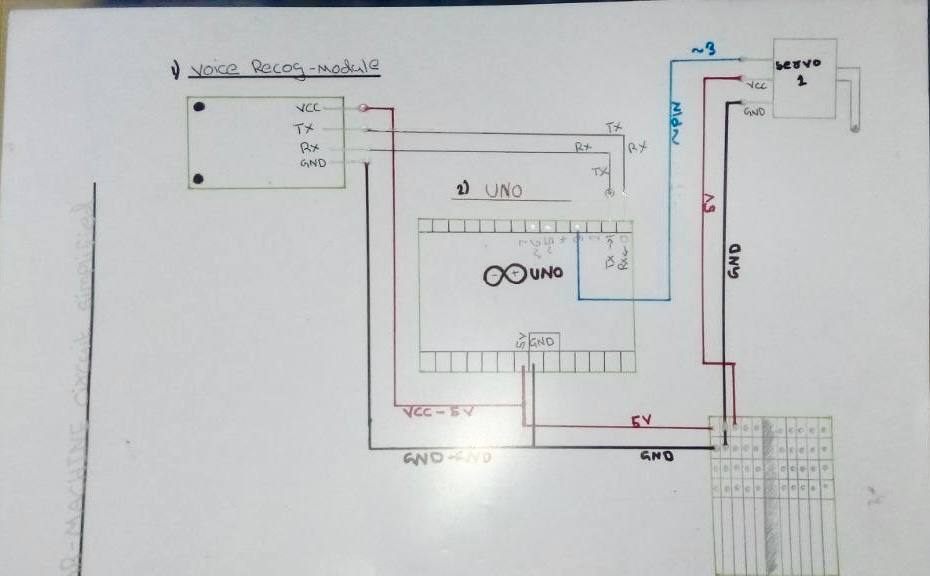
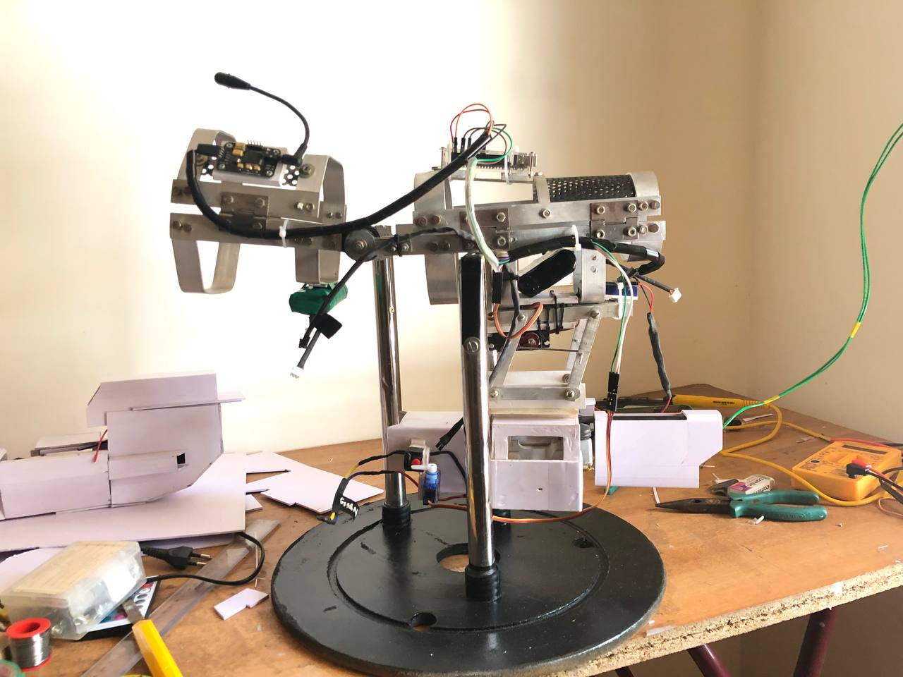
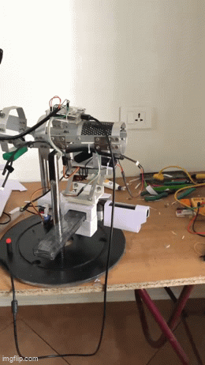

# Voice-Controlled Iron Man Inspired Exoskeleton Arm

## Overview

This project is a handmade wearable exoskeleton arm inspired by Iron Man, designed and developed from scratch using Arduino UNO, servo motors, and a Geeetech Voice Recognition Module. The system enables hands-free control of articulated arm movements through predefined voice commands.

The project involved complete mechanical fabrication, electronics integration, embedded software development, and extensive testing to create a functional wearable prototype.

More than **120+ hours** were invested in designing, fabricating, programming, testing, and refining the system.

## Key Features

* Voice-controlled actuation
* Wearable exoskeleton design
* Real-time command execution
* Servo-driven articulated movement
* Embedded control using Arduino UNO
* Custom handmade mechanical structure
* Hands-free operation through voice recognition

## Hardware Used

* Arduino UNO R3
* Geeetech Voice Recognition Module
* High-Torque Servo Motors
* Jumper Wires (Male-to-Male, Female-to-Female, Male-to-Female)
* External Battery Power Supply (4V-9V)
* Buck Voltage Regulator Module
* Custom Handmade Aluminium-Based Exoskeleton Structure
* Mechanical Linkages and Mounting Assemblies

## Source Code

The embedded software for this project is provided in text format.

The code can be directly copied into the Arduino IDE, saved as an `.ino` sketch, and modified according to the hardware configuration and servo calibration requirements.

Future updates will include a complete Arduino project structure with improved documentation and circuit diagrams.

The code can be directly copied into the Arduino IDE, saved as an `.ino` sketch, and modified according to the hardware configuration and servo calibration requirements.

## Hardware Wiring Diagram

The following hand-drawn wiring diagram illustrates the complete hardware interconnections used in the project, including component interfaces, power connections, and serial communication links.


> Note: The diagram was manually created during the hardware development phase and documents the actual connections used in the prototype.

Future updates will include a complete Arduino project structure with improved documentation and circuit diagrams.

# Voice-Controlled Iron Man Inspired Exoskeleton Arm

## Overview

## Key Features

## Hardware Used

## Working Principle

## Project Images

### Side View


## Demonstration



Full demonstration video: exoskeleton_demo.mp4

## Hardware Connections


Additional documentation:
- Physical_Hardware_Arrangement.pdf

## Source Code

The source code can be directly copied into the Arduino IDE and modified according to the hardware configuration.

## Repository Structure

```text
Voice-Controlled-Iron-Man-Exoskeleton-Arm/
│
├── README.md
├── LICENSE
├── iron_man_exoskeleton_controller.ino
├── exoskeleton_demo.gif
├── exoskeleton_demo.mp4
├── side_view.jpg
├── hardware_connections.jpg
└── physical_hardware_arrangement.pdf
